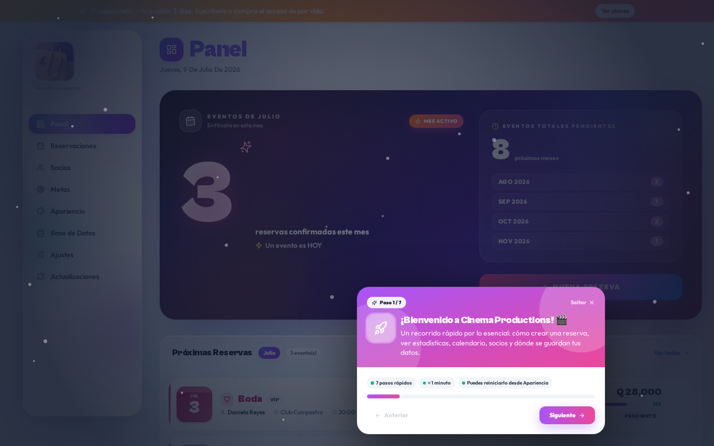
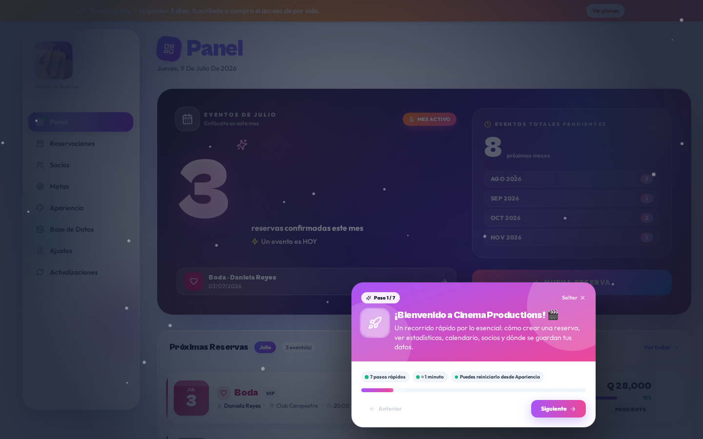

<div align="center">


# Cinema Productions · Reserva de Eventos


**🇬🇹 Hecho con orgullo en Guatemala 🇬🇹**

*Software desarrollado localmente en Guatemala por [@AlejandroPiedrasanta](https://github.com/AlejandroPiedrasanta).*

[](#-planes-y-precios)
[](#-planes-y-precios)
[](#-planes-y-precios)

</div>

---

## 💳 Planes y precios

Cinema Productions es un **producto comercial**. Puedes probarlo gratis durante 3 días y luego elegir el plan que mejor se adapte a tu negocio.

| Plan | Precio | Ideal para |
|---|---|---|
| 🆓 **Prueba gratuita** | **3 días** sin costo · sin tarjeta | Evaluar todas las funciones antes de comprar |
| 💎 **Pago único (permanente)** | Pago único · licencia vitalicia | Empresas que quieren instalación local para siempre, sin cuotas recurrentes |
| 🔁 **Suscripción mensual** | Pago mensual · actualizaciones incluidas | Quienes prefieren cuotas bajas + soporte y updates continuos |

> Al iniciar la app por primera vez recibes automáticamente **72 horas de prueba completa**. Al terminar la prueba, la aplicación pedirá una licencia (permanente o suscripción activa) para seguir funcionando.

**Para adquirir una licencia** o solicitar una demo comercial, contacta con [@AlejandroPiedrasanta](https://github.com/AlejandroPiedrasanta).

---

Aplicación **full-stack** para la gestión y reserva de eventos de Cinema Productions, con **doble modo de entrega**:

- 🌐 **Web** (React + FastAPI + MongoDB) — desplegable en cualquier proveedor.
- 🖥️ **Windows Desktop** (`.exe` portable + instalador) — corre 100 % en local sin necesidad de Python ni Node instalados.

---

## 📸 Vista previa

<table>
  <tr>
    <td align="center" width="33%">
      <br/>
      <sub><b>Panel</b> — métricas del mes y próximas reservas</sub>
    </td>
    <td align="center" width="33%">
      <br/>
      <sub><b>Calendario</b> — reservas mes/lista con búsqueda</sub>
    </td>
    <td align="center" width="33%">
      <br/>
      <sub><b>Socios</b> — rotación automática de pagos y deudas</sub>
    </td>
  </tr>
</table>

> Diseño *Glass Aurora* con acentos violetas, tipografía moderna y una tour guiada de 7 pasos al primer uso.

---

## ⬇️ Descargas por plataforma

Todos los binarios llevan el nuevo ícono de la app y se publican automáticamente desde GitHub Actions. Un solo clic → doble clic → funciona.

<table>
  <tr>
    <td align="center">
      <a href="https://github.com/AlejandroPiedrasanta/RESERVA-DE-EVENTOS/releases/latest/download/CinemaProductions-Setup.exe">
        
      </a><br/><sub>Windows 10/11 · Recomendado</sub>
    </td>
    <td align="center">
      <a href="https://github.com/AlejandroPiedrasanta/RESERVA-DE-EVENTOS/releases/latest/download/CinemaProductions.exe">
        
      </a><br/><sub>Windows · Sin instalar</sub>
    </td>
    <td align="center">
      <a href="https://github.com/AlejandroPiedrasanta/RESERVA-DE-EVENTOS/releases/latest/download/CinemaProductions-macos-arm64">
        
      </a><br/><sub>Apple Silicon (M1/M2/M3/M4)</sub>
    </td>
    <td align="center">
      <a href="https://github.com/AlejandroPiedrasanta/RESERVA-DE-EVENTOS/releases/latest/download/CinemaProductions-linux-x86_64">
        
      </a><br/><sub>Ubuntu, Debian, Fedora…</sub>
    </td>
    <td align="center">
      <a href="https://github.com/AlejandroPiedrasanta/RESERVA-DE-EVENTOS/releases/latest/download/CinemaProductions-linux-arm64">
        
      </a><br/><sub>Raspberry Pi 4/5 · Graviton</sub>
    </td>
  </tr>
</table>

<sub>Cada asset incluye su archivo `.sha256`. Verifica la integridad antes de ejecutar en producción. [Ver todas las releases →](https://github.com/AlejandroPiedrasanta/RESERVA-DE-EVENTOS/releases)</sub>

---

## 📚 Tabla de contenido

- [Planes y precios](#-planes-y-precios)
- [Vista previa](#-vista-previa)
- [Descargas por plataforma](#️-descargas-por-plataforma)
- [Descarga rápida (Windows)](#-descarga-rápida-windows)
- [Características](#-características)
- [Arquitectura](#-arquitectura)
- [Uso en modo Desktop (Windows .exe)](#️-uso-en-modo-desktop-windows-exe)
- [Instalación local (desarrollo)](#-instalación-local-desarrollo)
- [Compilar el .exe manualmente](#-compilar-el-exe-manualmente)
- [Compilación automática con GitHub Actions](#-compilación-automática-con-github-actions)
- [Estructura del repositorio](#-estructura-del-repositorio)
- [Publicar una nueva versión](#-publicar-una-nueva-versión)
- [Solución de problemas](#-solución-de-problemas)
- [Licencia](#-licencia)

---

## 🚀 Descarga rápida (Windows)

Los binarios se publican automáticamente en la sección **[Releases](https://github.com/AlejandroPiedrasanta/RESERVA-DE-EVENTOS/releases)** de este repositorio.

| Archivo | Descripción | ¿Requiere admin? |
|---|---|---|
| **`CinemaProductions-Setup.exe`** | Instalador (recomendado). Crea accesos directos en Escritorio y Menú Inicio, y añade la app a *Aplicaciones y Características*. | ❌ No (instala en `%LocalAppData%`) |
| **`CinemaProductions.exe`** | Ejecutable portable. Doble clic y listo — ideal para USB o pruebas rápidas. | ❌ No |
| **`*.sha256`** | Suma SHA-256 para verificar la integridad del descargado. | — |

**Verificar integridad** (PowerShell):

```powershell
Get-FileHash .\CinemaProductions-Setup.exe -Algorithm SHA256
Get-FileHash .\CinemaProductions.exe       -Algorithm SHA256
```

> ⚠️ La primera vez, Windows SmartScreen puede advertirte porque los binarios no están firmados con un certificado EV. Pulsa **Más información → Ejecutar de todos modos**.

---

## ✨ Características

- 📅 **Reserva de eventos** con calendario interactivo, franjas horarias y validación de solapamiento.
- 👥 **Gestión de clientes, servicios y personal**.
- 🧾 **Presupuestos, contratos y facturación** exportables a PDF.
- 🎨 **Temas personalizables** (persistencia en `themes/saved_themes.json`).
- 🔔 **Notificaciones push** (VAPID / `pywebpush`) y programación con APScheduler.
- 🤖 **Asistente con contexto IA** (`ai_context_default.py`) editable.
- 🌐 **Servidor local embebido** en el `.exe` — abre `http://127.0.0.1:8001` automáticamente en tu navegador.
- 🔄 **Auto-actualización**: la app consulta `version.txt` del repo y avisa cuando hay versión nueva.

---

## 🏗️ Arquitectura

```
┌──────────────────────────────────────────────────────────────┐
│  Cliente (navegador o WebView del .exe)                      │
│                                                              │
│   React 19  ·  Tailwind  ·  shadcn/ui  ·  service-worker    │
└─────────────────────────────┬────────────────────────────────┘
                              │  REST  (/api/*)
┌─────────────────────────────▼────────────────────────────────┐
│  FastAPI  ·  uvicorn  ·  APScheduler                         │
│                                                              │
│   • server.py           → variante web (contenedores)        │
│   • standalone_app.py   → variante desktop (embebida .exe)   │
└─────────────────────────────┬────────────────────────────────┘
                              │  Motor async driver
┌─────────────────────────────▼────────────────────────────────┐
│  MongoDB     (Atlas en web · local/embebido en desktop)      │
└──────────────────────────────────────────────────────────────┘
```

Consulta [`ARCHITECTURE.md`](./ARCHITECTURE.md) para el detalle técnico.

---

## 🖥️ Uso en modo Desktop (Windows .exe)

1. Descarga `CinemaProductions-Setup.exe` desde la [última release](https://github.com/AlejandroPiedrasanta/RESERVA-DE-EVENTOS/releases/latest).
2. Doble clic → sigue el asistente (idioma español disponible).
3. Al finalizar la instalación, la app se lanza sola. Verás:
   - Un icono en el escritorio y en el menú Inicio.
   - Una ventana de consola (mínima) con el backend embebido.
   - Tu navegador por defecto abrirá `http://127.0.0.1:8001`.
4. Para desinstalar: **Panel de control → Aplicaciones → Cinema Productions → Desinstalar**.

**Datos y configuración**: se guardan en `%LocalAppData%\CinemaProductions\`. Copia esta carpeta si quieres respaldar tu información.

---

## 💻 Instalación local (desarrollo)

### Requisitos

- Python **3.11+**
- Node.js **20+** y Yarn **1.22+**
- MongoDB (local o Atlas)

### Backend

```bash
cd backend
python -m venv .venv
source .venv/bin/activate         # Windows: .venv\Scripts\activate
pip install -r requirements.txt

# .env mínimo
cat > .env <<EOF
MONGO_URL=mongodb://localhost:27017
DB_NAME=cinema_productions
CORS_ORIGINS=*
EOF

uvicorn server:app --host 0.0.0.0 --port 8001 --reload
```

### Frontend

```bash
cd frontend
yarn install
echo "REACT_APP_BACKEND_URL=http://localhost:8001" > .env
yarn start           # abre http://localhost:3000
```

---

## 🔨 Compilar el .exe manualmente

> Solo Windows (o una VM/GitHub Actions con `windows-latest`).

```powershell
# 1. Dependencias
python -m pip install --upgrade pip
pip install -r backend\requirements.txt
pip install "pyinstaller>=6.10,<7" pillow

# 2. Frontend production build (apuntando al servidor local embebido)
cd frontend
$env:REACT_APP_BACKEND_URL="http://127.0.0.1:8001"
$env:CI="false"
yarn install --frozen-lockfile
yarn build
cd ..

# 3. Preparar payload
New-Item -ItemType Directory -Force -Path backend\_bundle | Out-Null
Copy-Item -Recurse -Force frontend\build backend\_bundle\build
Copy-Item backend\ai_context_default.py backend\_bundle\
Copy-Item version.txt                    backend\_bundle\
New-Item -ItemType Directory -Force -Path backend\_bundle\themes | Out-Null
Copy-Item themes\saved_themes.json       backend\_bundle\themes\

# 4. Icono
python -c "from PIL import Image; im=Image.open('frontend/public/logo.png').convert('RGBA'); w,h=im.size; s=max(w,h); c=Image.new('RGBA',(s,s),(0,0,0,0)); c.paste(im,((s-w)//2,(s-h)//2)); c.save('frontend/public/favicon.ico', sizes=[(16,16),(32,32),(48,48),(64,64),(128,128),(256,256)])"

# 5. PyInstaller
pyinstaller --onefile --name CinemaProductions `
  --icon frontend\public\favicon.ico `
  --add-data "backend\_bundle\build;build" `
  --add-data "backend\_bundle\ai_context_default.py;." `
  --add-data "backend\_bundle\version.txt;." `
  --add-data "backend\_bundle\themes;themes" `
  --hidden-import motor.motor_asyncio --hidden-import pymongo --hidden-import bson `
  --hidden-import apscheduler.schedulers.asyncio `
  --hidden-import apscheduler.triggers.cron --hidden-import apscheduler.triggers.interval `
  --hidden-import pywebpush --hidden-import PIL `
  --collect-submodules uvicorn --collect-submodules fastapi `
  backend\standalone_app.py

# 6. Instalador (opcional, requiere Inno Setup 6)
Copy-Item build\installer.iss dist\installer.iss
& "C:\Program Files (x86)\Inno Setup 6\ISCC.exe" /DMyAppVersion=1.0.0 dist\installer.iss
```

El artefacto quedará en `dist\CinemaProductions.exe` y `dist\CinemaProductions-Setup.exe`.

---

## 🤖 Compilación automática con GitHub Actions

El workflow [`.github/workflows/build-exe.yml`](./.github/workflows/build-exe.yml) compila el `.exe` y el instalador, y los **publica como assets de la release** automáticamente.

### Disparadores

| Disparador | Efecto |
|---|---|
| `git push` de un tag `v*` (ej. `v1.2.0`) | Compila y crea/actualiza la release **`v1.2.0`** (definitiva). |
| Ejecución manual (**Actions → Build Windows .exe → Run workflow**) | Compila y crea/actualiza la release **`latest-exe`** (prerelease). |

### Requisitos previos en el repo

- `build/installer.iss` (incluido) — script de Inno Setup.
- `.github/workflows/refresh-deps.yml` mantiene el caché de dependencias frescas.
- Permiso de escritura del workflow (`permissions: contents: write`, ya configurado).

---

## 📁 Estructura del repositorio

```
.
├── .github/workflows/
│   ├── build-exe.yml           # Compila .exe + instalador y publica la release
│   └── refresh-deps.yml        # Cachea node_modules + wheels en release deps-latest
├── backend/
│   ├── server.py               # FastAPI (variante web)
│   ├── standalone_app.py       # FastAPI (variante desktop empaquetada)
│   ├── ai_context_default.py   # Contexto por defecto del asistente IA
│   ├── desktop_package.py      # Helpers de empaquetado
│   └── requirements.txt
├── frontend/
│   ├── src/                    # React 19 + shadcn/ui
│   ├── public/                 # logo.png, index.html, sw.js
│   └── package.json
├── build/
│   └── installer.iss           # Script de Inno Setup 6
├── themes/
│   └── saved_themes.json
├── ARCHITECTURE.md             # Arquitectura detallada
├── bootstrap.sh                # Setup rápido en pods Emergent
├── version.txt                 # Fuente de verdad de la versión actual
└── README.md                   # este archivo
```

---

## 🏷️ Publicar una nueva versión

```bash
# 1. Actualiza version.txt (semver)
echo "1.2.0" > version.txt
git add version.txt && git commit -m "chore: bump v1.2.0"

# 2. Crea el tag y súbelo
git tag v1.2.0
git push origin main --tags
```

GitHub Actions detectará el tag `v*`, compilará el `.exe` y el instalador, y creará la **Release `v1.2.0`** con los assets adjuntos. El proceso tarda ~10-15 min.

Para builds intermedios sin tag: **Actions → Build Windows .exe → Run workflow** (usa la release móvil `latest-exe`).

---

## 🧯 Solución de problemas

### El workflow `Build Windows .exe` falla con *"No existe build/installer.iss en el repo"*

Este error ocurría en versiones anteriores del workflow. Ya está resuelto: `build/installer.iss` está incluido. Si aparece:

```bash
git pull origin main   # asegúrate de tener la última versión
ls build/installer.iss # debe existir
```

### El .exe se cierra al abrir en Windows

Ejecútalo desde `cmd` para ver el log:

```powershell
cd %LocalAppData%\CinemaProductions
CinemaProductions.exe
```

Causas comunes:

- **Puerto 8001 ocupado**: cierra la instancia previa (`taskkill /IM CinemaProductions.exe /F`) o cambia el puerto en `standalone_app.py`.
- **MongoDB no accesible**: la variante desktop usa una BD embebida en `%LocalAppData%\CinemaProductions\db`. Bórrala si se corrompió.
- **Antivirus** bloqueando el `.exe`: añádelo a exclusiones.

### SmartScreen bloquea la instalación

Los binarios se firman por hash SHA-256 pero **no** con un certificado EV (coste anual). Pulsa **Más información → Ejecutar de todos modos**. La verificación por hash del release es suficiente para confirmar la autenticidad.

### `yarn build` falla con *"heap out of memory"*

```powershell
$env:NODE_OPTIONS="--max-old-space-size=4096"
yarn build
```

---

## 📄 Licencia

Copyright © Cinema Productions.
**Software comercial** — se ofrece con:

- 🆓 **Versión de prueba de 3 días** (72 h) al iniciar el `.exe` por primera vez.
- 💎 **Licencia de pago permanente** (pago único, sin caducidad).
- 🔁 **Suscripción mensual** (actualizaciones y soporte incluidos).

Cualquier redistribución, revenda o uso comercial sin licencia válida está prohibido. Contacta al autor para adquirir una licencia o solicitar una demo.

---

<div align="center">


**Hecho en Guatemala 🇬🇹 · Made in Guatemala**

</div>

**Autor**: [@AlejandroPiedrasanta](https://github.com/AlejandroPiedrasanta) — [Repositorio](https://github.com/AlejandroPiedrasanta/RESERVA-DE-EVENTOS)
